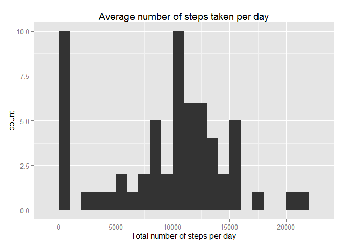
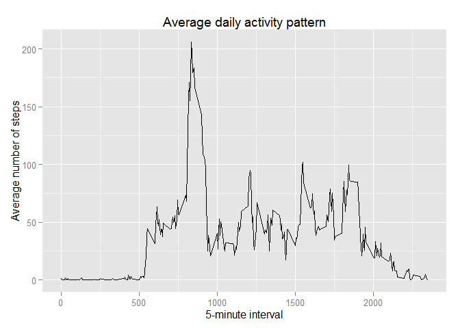
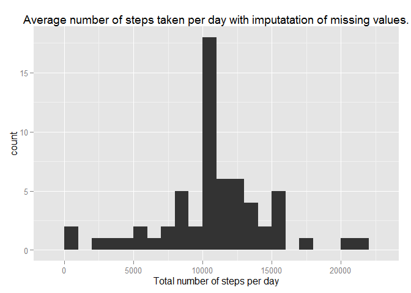
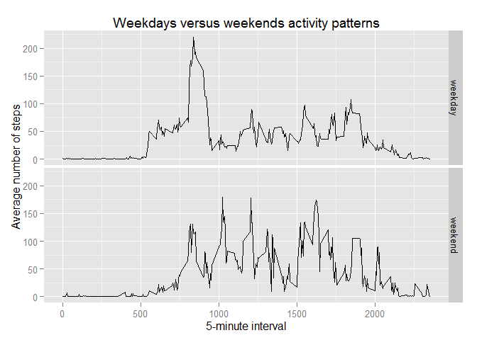

# Reproducible Research: Peer Assessment 1
Laura Grajeda  
1 de abril de 2016  


## Objective

This is an Rmarkdown document to describe the steps taken to solve the project # 1 of the Reproducible Research Course. The data was analysed using the following steps:

1. Load the data
2. Summarize the number of steps taken by day
3. Describe the pattern of daily activity
4. Impute missing values in the steps variable
5. describe activity patterns of weekdays versus weekends


## 1. Loading the data

The data was dowloaded from the course project 1 website on april 1st, 2016. The URL is "https://d396qusza40orc.cloudfront.net/repdata%2Fdata%2Factivity.zip"  The code below show the functions used to download the data. Notice that it was downloaded only once (functions have been transformed to comments). In subsequent runs of this markdown document, the data is loaded from the project directory.


```r
#dowload database
#setwd("~/2014-09-10_FETP/Libros y cursos/coursera/5_Reproducible research/Project 1")
#url<-"https://d396qusza40orc.cloudfront.net/repdata%2Fdata%2Factivity.zip"
#download.file(url, destfile = "DataProject1.zip")
#unzip("dataproject1.zip")
#list.files()
# open database
setwd("~/2014-09-10_FETP/Libros y cursos/coursera/5_Reproducible research/Project 1")
act<-read.csv("activity.csv")
head(act)
```

```
##   steps       date interval
## 1    NA 2012-10-01        0
## 2    NA 2012-10-01        5
## 3    NA 2012-10-01       10
## 4    NA 2012-10-01       15
## 5    NA 2012-10-01       20
## 6    NA 2012-10-01       25
```


```r
summary(act$steps)
```

```
##    Min. 1st Qu.  Median    Mean 3rd Qu.    Max.    NA's 
##    0.00    0.00    0.00   37.38   12.00  806.00    2304
```

```r
summary(act$date)
```

```
## 2012-10-01 2012-10-02 2012-10-03 2012-10-04 2012-10-05 2012-10-06 
##        288        288        288        288        288        288 
## 2012-10-07 2012-10-08 2012-10-09 2012-10-10 2012-10-11 2012-10-12 
##        288        288        288        288        288        288 
## 2012-10-13 2012-10-14 2012-10-15 2012-10-16 2012-10-17 2012-10-18 
##        288        288        288        288        288        288 
## 2012-10-19 2012-10-20 2012-10-21 2012-10-22 2012-10-23 2012-10-24 
##        288        288        288        288        288        288 
## 2012-10-25 2012-10-26 2012-10-27 2012-10-28 2012-10-29 2012-10-30 
##        288        288        288        288        288        288 
## 2012-10-31 2012-11-01 2012-11-02 2012-11-03 2012-11-04 2012-11-05 
##        288        288        288        288        288        288 
## 2012-11-06 2012-11-07 2012-11-08 2012-11-09 2012-11-10 2012-11-11 
##        288        288        288        288        288        288 
## 2012-11-12 2012-11-13 2012-11-14 2012-11-15 2012-11-16 2012-11-17 
##        288        288        288        288        288        288 
## 2012-11-18 2012-11-19 2012-11-20 2012-11-21 2012-11-22 2012-11-23 
##        288        288        288        288        288        288 
## 2012-11-24 2012-11-25 2012-11-26 2012-11-27 2012-11-28 2012-11-29 
##        288        288        288        288        288        288 
## 2012-11-30 
##        288
```

```r
summary(act$interval)
```

```
##    Min. 1st Qu.  Median    Mean 3rd Qu.    Max. 
##     0.0   588.8  1178.0  1178.0  1766.0  2355.0
```


## 2. What is mean total number of steps taken per day?


We want to explore the number of steps taken per day. To do that we will:
1.  Calculate the total number of steps taken per day
2.  Make a histogram of the total number of steps taken each day
3.  Calculate and report the mean and median of the total number of steps taken per day


```r
library(dplyr)
```

```
## Warning: package 'dplyr' was built under R version 3.2.3
```

```
## 
## Attaching package: 'dplyr'
## 
## The following objects are masked from 'package:stats':
## 
##     filter, lag
## 
## The following objects are masked from 'package:base':
## 
##     intersect, setdiff, setequal, union
```

```r
StepsDay <-act %>% group_by(date) %>% summarise(TotalNumberStepsPerDay = sum(steps, na.rm=T))
library(ggplot2)
HistStepsDay <- ggplot(data=StepsDay, aes(TotalNumberStepsPerDay)) + 
        geom_histogram(binwidth=1000) +
        xlab("Total number of steps per day") + ggtitle("Average number of steps taken per day")
HistStepsDay
```

 

```r
summary(StepsDay$TotalNumberStepsPerDay)
```

```
##    Min. 1st Qu.  Median    Mean 3rd Qu.    Max. 
##       0    6778   10400    9354   12810   21190
```

```r
StepsDay %>% summarise(Median = median(TotalNumberStepsPerDay, na.rm=T), Mean= mean(TotalNumberStepsPerDay, na.rm=T))
```

```
## Source: local data frame [1 x 2]
## 
##   Median    Mean
##    (int)   (dbl)
## 1  10395 9354.23
```

```r
StepsDay %>% filter(TotalNumberStepsPerDay!=0) %>% summarise(Median = median(TotalNumberStepsPerDay, na.rm=T), Mean= mean(TotalNumberStepsPerDay, na.rm=T))
```

```
## Source: local data frame [1 x 2]
## 
##   Median     Mean
##    (int)    (dbl)
## 1  10765 10766.19
```

The total number of steps taken by day ranges from 0 to 21,190. The median number of steps is 10,395 and the mean is 9,354 steps. However, when taking out the measurements when steps were not recorded (steps=NA), the distribution of steps by day becomes approximately normal with a median of 10,765 steps  and a mean of 10,766 steps per day.


## 3. What is the average daily activity pattern?

To explore the daily activity pattern we will:

1. Make a time series plot (i.e. type = "l") of the 5-minute interval (x-axis) and the average number of steps taken, averaged across all days (y-axis)
2. Which 5-minute interval, on average across all the days in the dataset, contains the maximum number of steps?


```r
#preprocessing the data
StepsInterval <- act %>% group_by(interval) %>% summarise( MeanStepsPerInterval = mean(steps, na.rm=T))
StepsInterval
```

```
## Source: local data frame [288 x 2]
## 
##    interval MeanStepsPerInterval
##       (int)                (dbl)
## 1         0            1.7169811
## 2         5            0.3396226
## 3        10            0.1320755
## 4        15            0.1509434
## 5        20            0.0754717
## 6        25            2.0943396
## 7        30            0.5283019
## 8        35            0.8679245
## 9        40            0.0000000
## 10       45            1.4716981
## ..      ...                  ...
```

```r
#do the graph
DailyPatters <- ggplot(data=StepsInterval, aes(x=interval, y=MeanStepsPerInterval)) +
        geom_line() +
        ylab("Average number of steps") + xlab("5-minute interval") + ggtitle("Average daily activity pattern")
DailyPatters
```

 

```r
#obtain the maximun average steps per interval
StepsInterval %>% summarise( max = max(MeanStepsPerInterval, na.rm=T))
```

```
## Source: local data frame [1 x 1]
## 
##        max
##      (dbl)
## 1 206.1698
```

```r
# obtain the interval corresponding to the maximun average number of steps
StepsInterval %>% filter(MeanStepsPerInterval > 206)
```

```
## Source: local data frame [1 x 2]
## 
##   interval MeanStepsPerInterval
##      (int)                (dbl)
## 1      835             206.1698
```


The maximun average steps in a 5 minute interval is 206. It corresponds to the interval number 835.


## 4. Imputing missing values

1.  Calculate and report the total number of missing values in the dataset (i.e. the total number of rows with NAs)
2.  Choose a method to fill out the missing values. 
3.  Create a new data set Filling out the missing values.
4.  Make a histogram of the total number of steps taken each day and Calculate and report the mean and median total number of steps taken per day. 


```r
# Total number of missing values
act %>% filter(is.na(interval)|is.na(date)|is.na(steps)) %>% summarize(n())
```

```
##    n()
## 1 2304
```

```r
# method selected to imput missing values
StepsInterval
```

```
## Source: local data frame [288 x 2]
## 
##    interval MeanStepsPerInterval
##       (int)                (dbl)
## 1         0            1.7169811
## 2         5            0.3396226
## 3        10            0.1320755
## 4        15            0.1509434
## 5        20            0.0754717
## 6        25            2.0943396
## 7        30            0.5283019
## 8        35            0.8679245
## 9        40            0.0000000
## 10       45            1.4716981
## ..      ...                  ...
```

```r
# create a new data base with the imputed missing values
pos=1
NewAct <- data.frame()
for(i in act$steps) {
        if(is.na(act[pos, "steps"])) {new<- StepsInterval %>% filter(interval==act[pos, "interval"])%>% select(MeanStepsPerInterval)}
        else {new<-act[pos, "steps"]}
        NewAct<-rbind(NewAct, new)
        pos=pos+1
}
NewAct<-cbind(act, NewAct)
head(NewAct)
```

```
##   steps       date interval MeanStepsPerInterval
## 1    NA 2012-10-01        0            1.7169811
## 2    NA 2012-10-01        5            0.3396226
## 3    NA 2012-10-01       10            0.1320755
## 4    NA 2012-10-01       15            0.1509434
## 5    NA 2012-10-01       20            0.0754717
## 6    NA 2012-10-01       25            2.0943396
```

```r
NewAct<-NewAct %>% rename(StepsImputed=MeanStepsPerInterval)

# create histogram of the total number of steps per day
StepsDay <-NewAct %>% group_by(date) %>% summarise(TotalNumberStepsPerDay = sum(StepsImputed, na.rm=T))
HistStepsDay <- ggplot(data=StepsDay, aes(TotalNumberStepsPerDay)) + 
        geom_histogram(binwidth=1000) +
        xlab("Total number of steps per day") + ggtitle("Average number of steps taken per day with imputatation of missing values.")
HistStepsDay
```

 

```r
summary(StepsDay$TotalNumberStepsPerDay)
```

```
##    Min. 1st Qu.  Median    Mean 3rd Qu.    Max. 
##      41    9819   10770   10770   12810   21190
```

```r
StepsDay %>% summarise(Median = median(TotalNumberStepsPerDay, na.rm=T), Mean= mean(TotalNumberStepsPerDay, na.rm=T))
```

```
## Source: local data frame [1 x 2]
## 
##     Median     Mean
##      (dbl)    (dbl)
## 1 10766.19 10766.19
```

The total number of missing values in the data set is 2,304. It was computed based on the number of rows having a missing value either in the variable "steps", "date" or "interval". However all the missings are found in the variable "steps".

Given that the day has a particular average activity pattern, for example the first 500 intervals are always time with very los activity, I filled the missing values with the average calculated from other days of that interval. The new data set is call NewAct. It contaians 4 variables ("steps", "date", "interval", "StepsImputed."). The last variable correspond to the one created by imputation.

Without the imputation, the median number of steps was 10,395 and the mean was 9,354 steps. With the imputation the mean and median are both 10,770 steps. The distribution of the total number of steps per day is normal.


## 5. Are there differences in activity patterns between weekdays and weekends?

1. Create a new factor variable in the dataset with two levels- "weekday" and "weekend" indicating whether a given date is a weekday or weekend day.
2. Make a panel plot containing a time series plot of the 5 monute interval (x-axis) and the average number of steps taken avergaed across all weekdays or weekend days (y-axis).


```r
# creating the variable
NewAct2 <- NewAct %>% mutate(Day = weekdays(as.POSIXct(date))) %>% 
        mutate(DayType = ifelse ((Day=="sabado" | Day=="domingo"), "weekend", "weekday")) 
StepsIntervalImputed <- NewAct2 %>% group_by(interval, DayType) %>% summarise(MeanStepsPerInterval = mean(StepsImputed, na.rm=T))
StepsIntervalImputed
```

```
## Source: local data frame [576 x 3]
## Groups: interval [?]
## 
##    interval DayType MeanStepsPerInterval
##       (int)   (chr)                (dbl)
## 1         0 weekday          1.943752225
## 2         0 weekend          0.214622642
## 3         5 weekday          0.384478462
## 4         5 weekend          0.042452830
## 5        10 weekday          0.149519402
## 6        10 weekend          0.016509434
## 7        15 weekday          0.170879316
## 8        15 weekend          0.018867925
## 9        20 weekday          0.085439658
## 10       20 weekend          0.009433962
## ..      ...     ...                  ...
```

```r
# doing the plot
WeekendPattern <- ggplot(data=StepsIntervalImputed, aes(x=interval, y=MeanStepsPerInterval)) +
        geom_line() +
        ylab("Average number of steps") + xlab("5-minute interval") + ggtitle("Weekdays versus weekends activity patterns") +
        facet_grid(DayType ~.)
WeekendPattern
```

 


Based on the plot there are differences in activity patterns from weekdays versus weekends. 


##THE END
